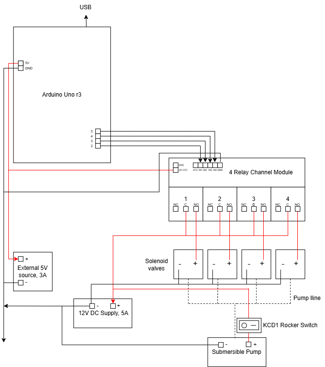

# 4-Channel Audio-Reactive Solenoid Water Fountain (Phase 1)

A real-time hydraulic projection installation that translates live multi-channel audio into physical water ripples projected on screen during the live performance of *"Strums and Verses on Sapumal Flowers"*.

Developed in collaboration with **Devin Nimthaka** (TouchDesigner DSP & Python Integration).



---

## Technical Overview & Signal Architecture

The system converts continuous, live acoustic energy into synchronized physical water ripples, projecting these dynamic fluid mechanics back onto a display screen in real time.

```text
[ Live Audio Performance ]
          │
          ▼  (Real-Time Spectrum Analysis)
[ TouchDesigner DSP Engine ]
          │  (Serial Output @ 115200 Baud)
          ▼
[ Arduino Microcontroller ]
          │  (5V Active-LOW Opto-Isolated Signals)
          ▼
[ Relay Array & Solenoids ]
          │  (12V DC High-Speed Hydraulic Actuation)
          ▼
[ Water Tank Ripple Formation ] ──► [ Optical Light Source ] ──► [ Real-Time Screen Projection ]
